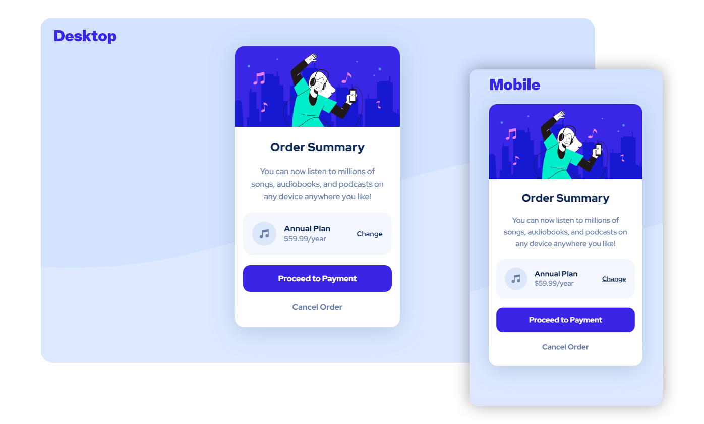

# Frontend Mentor - Order summary card solution

This is a solution to the [Order summary card challenge on Frontend Mentor](https://www.frontendmentor.io/challenges/order-summary-component-QlPmajDUj). Frontend Mentor challenges help you improve your coding skills by building realistic projects. 

 

## Table of contents

- [Overview](#overview)
  - [The challenge](#the-challenge)
  - [Screenshot](#screenshot)
  - [Links](#links)
- [My process](#my-process)
  - [Built with](#built-with)
  - [Useful resources](#useful-resources)
  - [Frontend Mentor Profile](#frontend-mentor-profile)

## 🔎 Overview

### The challenge

Users should be able to:

- See hover states for interactive elements;
- Have an accessible interface on both mobile and desktop viewports.

 

  

 

### Links

- Solution URL: [Order Summary Interface Component | Resolution](https://www.frontendmentor.io/solutions/order-summary-interface-component-resolution-IEfFKK2vde)
- Live Site URL: [Order Summary Interface Component](https://imperalis.github.io/order-summary-component-main/)

 

## 📚 My process

 

### Built with

- Semantic HTML5 markup
- CSS custom properties
- Flexbox
- CSS Grid
- Mobile-first workflow

 

### Useful resources

- [MDN Web Docs](https://developer.mozilla.org) - Great reference for modern CSS and semantic HTML usage.
- [CSS Tricks](https://css-tricks.com/snippets/css/a-guide-to-flexbox/) - Reference for flex display and many other visual guides.

 

## Frontend Mentor Profile

[@imperalis](https://www.frontendmentor.io/profile/imperalis)
